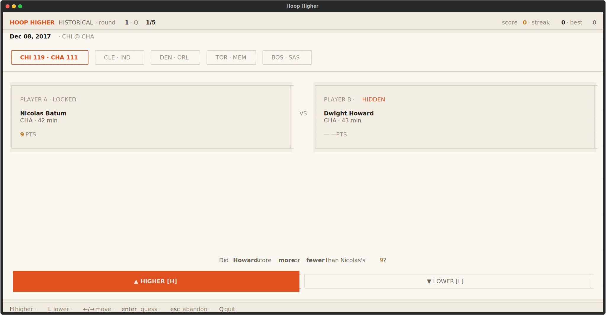

# Hoop Higher

[](https://pypi.org/project/hoop-higher/)
[](https://www.python.org/downloads/)



Hoop Higher is a terminal game for NBA fans: you see one player's points from an NBA box score, then guess whether another player scored higher or lower.

It is quick to start, easy to play from the keyboard, and built around short runs that test your NBA instincts one matchup at a time.

## Play

Run it without installing:

```bash
uvx hoop-higher
```

Or install the command:

```bash
uv tool install hoop-higher
hoop-higher
```

`hoop-higher` is the only supported command name.

## How It Works

Each question gives you a player and their point total. Your job is to decide whether the next player scored more or fewer points in that same game context.

After every guess, Hoop Higher reveals the answer, updates your score, and moves to the next comparison. Runs are saved locally so you can track your best scores, streaks, and overall stats.

## Game Modes

| Mode | What to expect |
| --- | --- |
| Endless | Keep playing through misses. Wrong answers cost points, but the run continues. |
| Arcade | One miss ends the run. Higher stakes, higher reward. |
| Historical | Play from randomly sampled historical NBA dates. |

## Controls

| Key | Action |
| --- | --- |
| `H` | Guess higher |
| `L` | Guess lower |
| `Left` / `Right` | Move between choices |
| `Enter` | Select or confirm |
| `Esc` | Go back |
| `Q` | Quit |
| `1`, `2`, `3` | Pick a game mode |

## Data

By default, Hoop Higher uses real NBA game data through `nba_api` and caches results locally so future runs are faster.

If the live NBA data source is slow or unavailable, you can still try the game instantly with mock data:

```bash
HOOPHIGHER_STATS_PROVIDER=mock uvx hoop-higher
```

Local scores, stats, and cached games are stored in `var/hoophigher.db`.

## From Source

```bash
git clone https://github.com/Davi-Gurgel/hoop-higher.git
cd hoop-higher
uv sync --all-groups
uv run hoop-higher
```

Run tests:

```bash
uv run pytest
```

## License

No license file is currently included in this repository.
